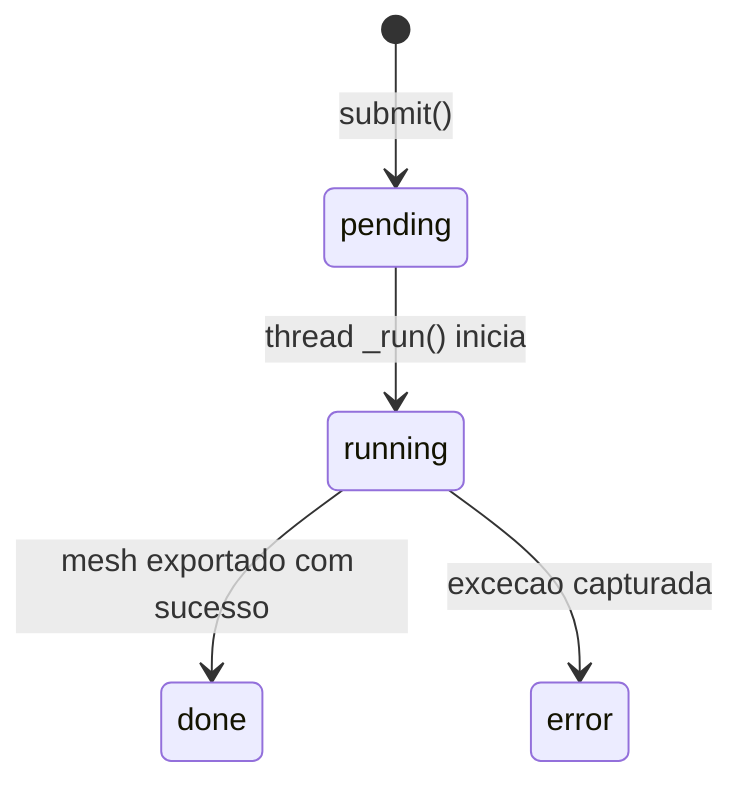

# Data Model — Image to 3D

> Documento vivo do modelo de dados. Atualizado sempre que uma entidade for criada, alterada ou removida.
> Ultima atualizacao: 2026-06-28 (v0.3.0 — history, timings and preview/full outputs)

---

## Indice

- [Visao Geral](#visao-geral)
- [Entidades](#entidades)
- [Decisoes de Modelagem](#decisoes-de-modelagem)

---

## Visao Geral

Modelo de dados do servico de geracao 3D. E composto por: estrutura de job para rastreamento assincrono, servico de modelo com lazy loading e deteccao de dispositivo, e paths de armazenamento XDG.

- **Origem:** Implementacao Python com FastAPI + PyTorch
- **Nivel de confianca:** EXATTO para todos os campos documentados (refletem o codigo fonte)
- **Nomenclatura:** Neutra, reflete nomes de atributos do codigo

---

## Entidades

### Job

Estrutura que representa uma requisicao de geracao 3D. Criada na submissao, atualizada durante o pipeline, consumida via polling.

**Arquivo:** `api/services/model_service.py:187-195`

| Campo | Tipo | Default | Descricao |
|-------|------|---------|-----------|
| `job_id` | str | UUID4 | Identificador unico do job |
| `status` | str | "pending" | Estado: pending, running, done, error |
| `progress` | int | 0 | Progresso estimado 0-100 |
| `step` | str | "" | Descricao textual da etapa atual |
| `output` | str or None | None | Nome do GLB completo gerado |
| `full_output` | str or None | None | Alias explicito do GLB completo para download |
| `preview_output` | str or None | None | GLB otimizado para visualizacao no browser |
| `preview` | str or None | None | Nome do PNG sanitizado salvo em `previews/` |
| `error` | str or None | None | Mensagem segura para o cliente em caso de erro |
| `settings` | dict | `{}` | Parametros resolvidos usados pelo job |
| `diagnostics` | dict | `{}` | Diagnosticos de request, preprocess, mesh, output e erro |
| `stage_timings` | dict | `{}` | Duracao por etapa do pipeline |
| `created_at` | float | timestamp | Instante de criacao do job |
| `updated_at` | float | timestamp | Ultima atualizacao do job |
| `completed_at` | float or None | None | Instante de conclusao ou erro |

**Transicoes de estado:**



### ModelService

Singleton que gerencia o modelo TripoSR, deteccao de dispositivo e fila de jobs.

**Arquivo:** `api/services/model_service.py:201-318`

| Atributo | Tipo | Descricao |
|----------|------|-----------|
| `_model` | TSR or None | Instancia do modelo (lazy loaded, sob lock) |
| `_lock` | threading.Lock | Lock para carga segura do modelo |
| `_jobs_lock` | threading.Lock | Lock para acesso ao dicionario de jobs |
| `_jobs` | Dict[str, Job] | Dicionario de jobs ativos |
| `_max_jobs` | int | Limite de jobs mantidos em memoria |
| `output_retention_days` | int | Idade maxima padrao para GLBs gerados |
| `max_output_files` | int | Quantidade maxima padrao de GLBs retidos |
| `device` | torch.device or None | Dispositivo de inferencia ativo |
| `device_name` | str | Nome legivel do dispositivo (e.g. "ROCm (7.1.0)", "CUDA (NVIDIA...)", "CPU") |

**Metodos:**

| Metodo | Descricao |
|--------|-----------|
| `_load()` | Carrega modelo TripoSR no dispositivo detectado (lazy, thread-safe) |
| `unload()` | Libera modelo da memoria |
| `submit(image_bytes, params)` | Cria job e inicia thread de processamento |
| `prepare_preview(image_bytes, params)` | Executa somente preprocessamento para preview/edicao de mascara |
| `get_job(job_id)` | Retorna job ou None |
| `_run(job, image_bytes, params)` | Pipeline completo de geracao (executado em thread) |
| `_preprocess(image_bytes)` | Remove fundo da imagem com rembg |
| `_write_job_metadata(job)` | Salva JSON sidecar ao lado do GLB gerado |
| `list_history(limit)` | Lista jobs concluidos a partir dos JSON sidecars persistidos |
| `cleanup_outputs(dry_run, max_age_days, max_files)` | Remove outputs/previews/metadata antigos ou excedentes |
| `_prune_jobs_locked()` | Remove jobs finalizados antigos quando `_max_jobs` e excedido |

### Generation Mode

| Valor | Descricao |
|-------|-----------|
| `auto` | Escolhe `silhouette` para imagens transparentes/delgadas e `ai` para objetos mais volumetricos |
| `ai` | Usa TripoSR para reconstruir volume completo a partir da imagem |
| `silhouette` | Extruda a mascara sanitizada em uma malha fina preservando a silhueta |

`silhouette` e indicado para objetos frontais e delgados, como laminas, logos, placas e icones.

### Input Source

| Valor | Descricao |
|-------|-----------|
| `sanitized` | Remove fundo quando necessario, recorta pelo foreground e centraliza em canvas quadrado |
| `original` | Preserva o enquadramento original, corrigindo EXIF e mantendo alpha quando existir |

### Generation Controls

| Campo | Default | Descricao |
|-------|---------|-----------|
| `object_type` | `auto` | Preset de UI: `auto`, `thin`, `icon`, `rounded` |
| `foreground_ratio` | `0.84` | Tamanho relativo do foreground no canvas sanitizado |
| `extrude_depth` | `0.08` | Profundidade da extrusao no modo `silhouette` |
| `alpha_threshold` | `8` | Corte de alpha usado para gerar a mascara |
| `mask_bias` | `0` | Ajuste morfologico da mascara: negativo reduz, positivo expande |
| `mask_edits` | `[]` | Strokes manuais normalizados: `mode`, `x`, `y`, `radius` |

### Job Metadata Sidecar

Cada job concluido grava um JSON em `outputs/` com o mesmo stem do GLB completo.

| Campo | Descricao |
|-------|-----------|
| `job_id` | Identificador do job original |
| `status` | Estado final do job |
| `output` | GLB completo, preservado por compatibilidade |
| `full_output` | GLB completo usado pelo botao de download |
| `preview_output` | GLB menor usado pelo viewer |
| `outputs` | Mapa `{full, preview}` para limpeza associada |
| `preview` | PNG RGBA do input preparado |
| `settings` | Parametros resolvidos, incluindo strokes de mascara |
| `diagnostics` | Dados de preprocess, mesh, output, erros e timings |
| `stage_timings` | Copia direta dos tempos por etapa |
| `created_at`, `updated_at`, `completed_at` | Timestamps Unix do ciclo de vida |

### Paths

Diretorios de armazenamento gerenciados pelo servico.

**Arquivo:** `api/services/model_service.py:58-63`

| Variavel | Path | Descricao |
|----------|------|-----------|
| `MODELS_DIR` | `{IMAGE3D_DATA_DIR}/models/` | Cache de source TripoSR e weights |
| `OUTPUTS_DIR` | `{IMAGE3D_DATA_DIR}/outputs/` | GLB gerados e metadata JSON |
| `PREVIEWS_DIR` | `{IMAGE3D_DATA_DIR}/previews/` | PNG sanitizados antes da geracao |

`IMAGE3D_DATA_DIR` e opcional. Quando ausente, o default e `~/.local/share/image3d/`.

### Retencao de outputs

O cleanup roda no startup da API e tambem pode ser chamado por `POST /api/cleanup`.

| Configuracao | Default | Descricao |
|--------------|---------|-----------|
| `IMAGE3D_OUTPUT_RETENTION_DAYS` | 14 | Remove GLBs mais antigos que este limite |
| `IMAGE3D_MAX_OUTPUT_FILES` | 100 | Remove GLBs excedentes mantendo os mais recentes |

Quando um GLB e removido, o JSON sidecar com mesmo stem e o preview PNG referenciado no JSON
tambem sao removidos. Metadata e previews orfaos antigos tambem sao limpos.

Estrutura em disco:

```
~/.local/share/image3d/
├── models/
│   ├── _triposr_src/
│   │   └── tsr/                     # Source code extraido do GitHub
│   │       ├── models/
│   │       │   ├── isosurface.py    # Patch (scikit-image)
│   │       │   └── ...              # Demais modulos TripoSR
│   │       └── ...
│   └── triposr/
│       ├── model.ckpt               # Weights (~1.5 GB)
│       └── config.yaml              # Configuracao do modelo
└── outputs/
    ├── {timestamp}_{uuid8}.glb      # GLB completo
    ├── {timestamp}_{uuid8}_preview.glb
    └── {timestamp}_{uuid8}.json     # Metadata do job
└── previews/
    ├── {job_id}_sanitized.png       # Entrada sanitizada usada pelo modelo
    └── {job_id}_original.png        # Entrada original preservada quando selecionada
```

### Device Detection

Logica de deteccao do melhor dispositivo disponivel.

**Arquivo:** `api/services/model_service.py:40-51`

| Prioridade | Condicao | Device | Device Name |
|------------|----------|--------|-------------|
| 1 | `torch.cuda.is_available()` e `torch.version.hip` presente | `cuda` | `ROCm (HIP {version})` |
| 2 | `torch.cuda.is_available()` sem HIP | `cuda` | `CUDA ({GPU name})` |
| 3 | Nenhum GPU disponivel | `cpu` | `CPU` |

**Fallback runtime:** Se `model.to(device)` falha (e.g., VRAM insuficiente), tenta CPU automaticamente.

### isosurface.py Patch

Implementacao substituta para `torchmcubes` usando scikit-image.

**Arquivo:** `api/services/model_service.py:74-112`

| Atributo/Metodo | Descricao |
|-----------------|-----------|
| `MarchingCubeHelper(resolution)` | Construtor: cria grid linear de vertices em [-1, 1] |
| `.grid_vertices` | Property: tensor [N^3, 3] com posicoes do grid |
| `.points_range` | Property: tuple (-1, 1) |
| `.__call__(level)` | Executa marching cubes, retorna (vertices: [M,3], faces: [K,3]) |

**Comportamento em erro:** Se `measure.marching_cubes` falha, retorna vertices e faces vazios.

---

## Decisoes de Modelagem

### ADR-001 — Job como dicionario em memoria

| Campo | Detalhe |
|-------|---------|
| **Status** | Aceita |
| **Data** | 2026-06-26 |
| **Contexto** | Necessario rastrear estado de jobs sem banco de dados |
| **Decisao** | Jobs armazenados em `Dict[str, Job]` na instancia do ModelService. Jobs sao perdidos ao reiniciar o servico. |
| **Consequencias** | Simplicidade maxima. Sem dependencia de banco. Jobs nao persistem entre restart. |

### ADR-002 — Threading em vez de fila externa

| Campo | Detalhe |
|-------|---------|
| **Status** | Aceita |
| **Data** | 2026-06-26 |
| **Contexto** | Processamento unico por vez (modelo carregado under lock) |
| **Decisao** | Usar `threading.Thread` daemon para cada job. Lock garante serializacao do modelo. |
| **Consequencias** | Jobs concorrentes aguardam o lock. GIL do Python limita paralelismo CPU. Adequado para uso local com 1 usuario. |

### ADR-003 — Paths XDG `~/.local/share/`

| Campo | Detalhe |
|-------|---------|
| **Status** | Aceita |
| **Data** | 2026-06-26 (v0.2.0) |
| **Contexto** | Necessario local padrao e organizado para cache de modelos e saidas |
| **Decisao** | Usar `~/.local/share/image3d/` seguindo a especificacao XDG Base Directory |
| **Consequencias** | Windows (legado) pode usar caminho diferente. Linux segue padrao XDG. Facil de limpar (basta remover o diretorio). |

### ADR-004 — ROCm como backend primario no Linux

| Campo | Detalhe |
|-------|---------|
| **Status** | Aceita |
| **Data** | 2026-06-26 (v0.2.0) |
| **Contexto** | AMD Radeon RX 7600 (gfx1102) com ROCm 7.1 |
| **Decisao** | PyTorch 2.12.1+rocm7.1 do indice oficial ROCm. Deteccao HIP para diferenciar de CUDA NVIDIA. |
| **Consequencias** | `torch.version.hip` distingue AMD de NVIDIA. torchmcubes nao tem suporte ROCm — exige patch isosurface. |
