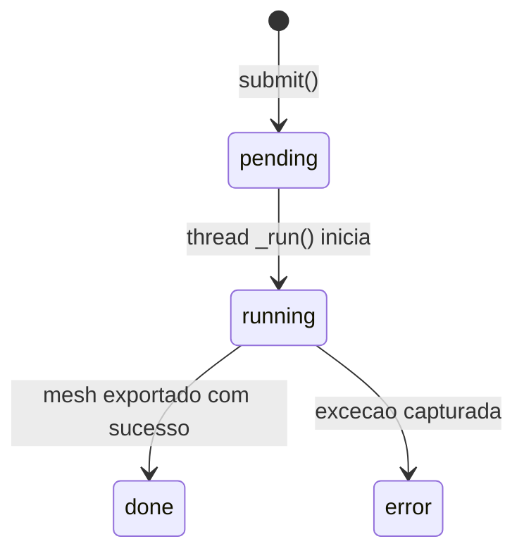

# Data Model — Image to 3D

> Documento vivo do modelo de dados. Atualizado sempre que uma entidade for criada, alterada ou removida.
> Ultima atualizacao: 2026-06-26 (v0.2.0 — ROCm Linux port)

---

## Indice

- [Visao Geral](#visao-geral)
- [Entidades](#entidades)
- [Decisoes de Modelagem](#decisoes-de-modelagem)

---

## Visao Geral

Modelo de dados do servico de geracao 3D. E composto por: estrutura de job para rastreamento assincrono, servico de modelo com lazy loading e deteccao de dispositivo, e paths de armazenamento XDG.

- **Origem:** Implementacao Python com FastAPI + PyTorch
- **Nivel de confianca:** EXATTO para todos os campos documentados (refletem o codigo fonte)
- **Nomenclatura:** Neutra, reflete nomes de atributos do codigo

---

## Entidades

### Job

Estrutura que representa uma requisicao de geracao 3D. Criada na submissao, atualizada durante o pipeline, consumida via polling.

**Arquivo:** `api/services/model_service.py:187-195`

| Campo | Tipo | Default | Descricao |
|-------|------|---------|-----------|
| `job_id` | str | UUID4 | Identificador unico do job |
| `status` | str | "pending" | Estado: pending, running, done, error |
| `progress` | int | 0 | Progresso estimado 0-100 |
| `step` | str | "" | Descricao textual da etapa atual |
| `output` | str or None | None | Nome do arquivo GLB gerado |
| `error` | str or None | None | Traceback em caso de erro |

**Transicoes de estado:**



### ModelService

Singleton que gerencia o modelo TripoSR, deteccao de dispositivo e fila de jobs.

**Arquivo:** `api/services/model_service.py:201-318`

| Atributo | Tipo | Descricao |
|----------|------|-----------|
| `_model` | TSR or None | Instancia do modelo (lazy loaded, sob lock) |
| `_lock` | threading.Lock | Lock para carga segura do modelo |
| `_jobs` | Dict[str, Job] | Dicionario de jobs ativos |
| `device` | torch.device or None | Dispositivo de inferencia ativo |
| `device_name` | str | Nome legivel do dispositivo (e.g. "ROCm (7.1.0)", "CUDA (NVIDIA...)", "CPU") |

**Metodos:**

| Metodo | Descricao |
|--------|-----------|
| `_load()` | Carrega modelo TripoSR no dispositivo detectado (lazy, thread-safe) |
| `unload()` | Libera modelo da memoria |
| `submit(image_bytes, params)` | Cria job e inicia thread de processamento |
| `get_job(job_id)` | Retorna job ou None |
| `_run(job, image_bytes, params)` | Pipeline completo de geracao (executado em thread) |
| `_preprocess(image_bytes)` | Remove fundo da imagem com rembg |

### Paths

Diretorios de armazenamento gerenciados pelo servico.

**Arquivo:** `api/services/model_service.py:58-63`

| Variavel | Path | Descricao |
|----------|------|-----------|
| `MODELS_DIR` | `~/.local/share/image3d/models/` | Cache de source TripoSR e weights |
| `OUTPUTS_DIR` | `~/.local/share/image3d/outputs/` | GLB gerados |

Estrutura em disco:

```
~/.local/share/image3d/
├── models/
│   ├── _triposr_src/
│   │   └── tsr/                     # Source code extraido do GitHub
│   │       ├── models/
│   │       │   ├── isosurface.py    # Patch (scikit-image)
│   │       │   └── ...              # Demais modulos TripoSR
│   │       └── ...
│   └── triposr/
│       ├── model.ckpt               # Weights (~1.5 GB)
│       └── config.yaml              # Configuracao do modelo
└── outputs/
    └── {timestamp}_{uuid8}.glb      # GLB gerados
```

### Device Detection

Logica de deteccao do melhor dispositivo disponivel.

**Arquivo:** `api/services/model_service.py:40-51`

| Prioridade | Condicao | Device | Device Name |
|------------|----------|--------|-------------|
| 1 | `torch.cuda.is_available()` e `torch.version.hip` presente | `cuda` | `ROCm (HIP {version})` |
| 2 | `torch.cuda.is_available()` sem HIP | `cuda` | `CUDA ({GPU name})` |
| 3 | Nenhum GPU disponivel | `cpu` | `CPU` |

**Fallback runtime:** Se `model.to(device)` falha (e.g., VRAM insuficiente), tenta CPU automaticamente.

### isosurface.py Patch

Implementacao substituta para `torchmcubes` usando scikit-image.

**Arquivo:** `api/services/model_service.py:74-112`

| Atributo/Metodo | Descricao |
|-----------------|-----------|
| `MarchingCubeHelper(resolution)` | Construtor: cria grid linear de vertices em [-1, 1] |
| `.grid_vertices` | Property: tensor [N^3, 3] com posicoes do grid |
| `.points_range` | Property: tuple (-1, 1) |
| `.__call__(level)` | Executa marching cubes, retorna (vertices: [M,3], faces: [K,3]) |

**Comportamento em erro:** Se `measure.marching_cubes` falha, retorna vertices e faces vazios.

---

## Decisoes de Modelagem

### ADR-001 — Job como dicionario em memoria

| Campo | Detalhe |
|-------|---------|
| **Status** | Aceita |
| **Data** | 2026-06-26 |
| **Contexto** | Necessario rastrear estado de jobs sem banco de dados |
| **Decisao** | Jobs armazenados em `Dict[str, Job]` na instancia do ModelService. Jobs sao perdidos ao reiniciar o servico. |
| **Consequencias** | Simplicidade maxima. Sem dependencia de banco. Jobs nao persistem entre restart. |

### ADR-002 — Threading em vez de fila externa

| Campo | Detalhe |
|-------|---------|
| **Status** | Aceita |
| **Data** | 2026-06-26 |
| **Contexto** | Processamento unico por vez (modelo carregado under lock) |
| **Decisao** | Usar `threading.Thread` daemon para cada job. Lock garante serializacao do modelo. |
| **Consequencias** | Jobs concorrentes aguardam o lock. GIL do Python limita paralelismo CPU. Adequado para uso local com 1 usuario. |

### ADR-003 — Paths XDG `~/.local/share/`

| Campo | Detalhe |
|-------|---------|
| **Status** | Aceita |
| **Data** | 2026-06-26 (v0.2.0) |
| **Contexto** | Necessario local padrao e organizado para cache de modelos e saidas |
| **Decisao** | Usar `~/.local/share/image3d/` seguindo a especificacao XDG Base Directory |
| **Consequencias** | Windows (legado) pode usar caminho diferente. Linux segue padrao XDG. Facil de limpar (basta remover o diretorio). |

### ADR-004 — ROCm como backend primario no Linux

| Campo | Detalhe |
|-------|---------|
| **Status** | Aceita |
| **Data** | 2026-06-26 (v0.2.0) |
| **Contexto** | AMD Radeon RX 7600 (gfx1102) com ROCm 7.1 |
| **Decisao** | PyTorch 2.12.1+rocm7.1 do indice oficial ROCm. Deteccao HIP para diferenciar de CUDA NVIDIA. |
| **Consequencias** | `torch.version.hip` distingue AMD de NVIDIA. torchmcubes nao tem suporte ROCm — exige patch isosurface. |
