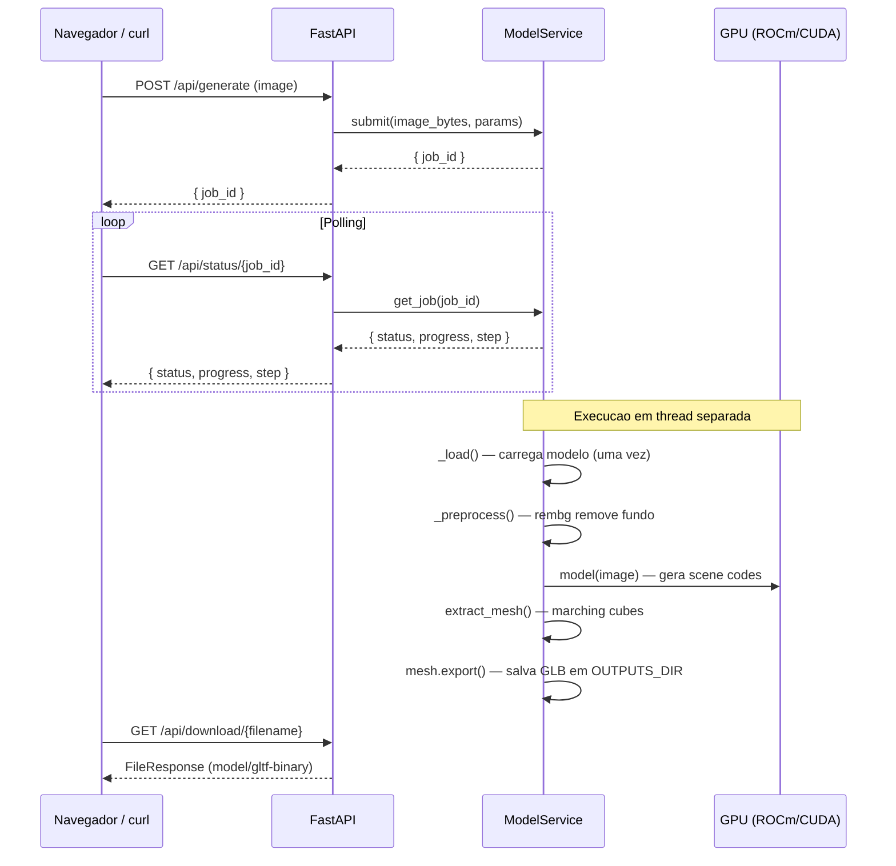
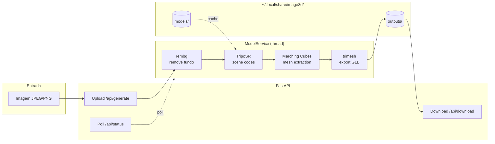
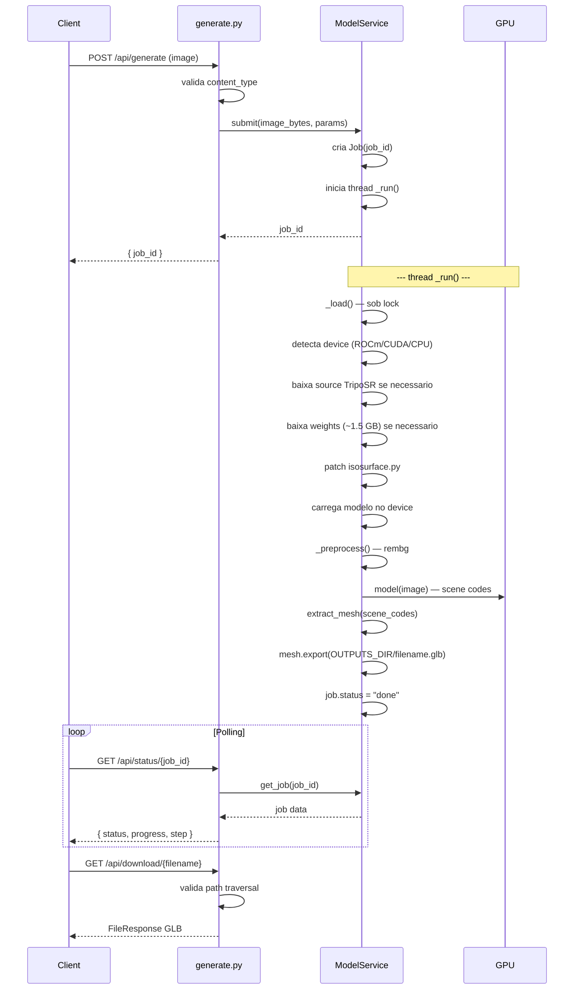
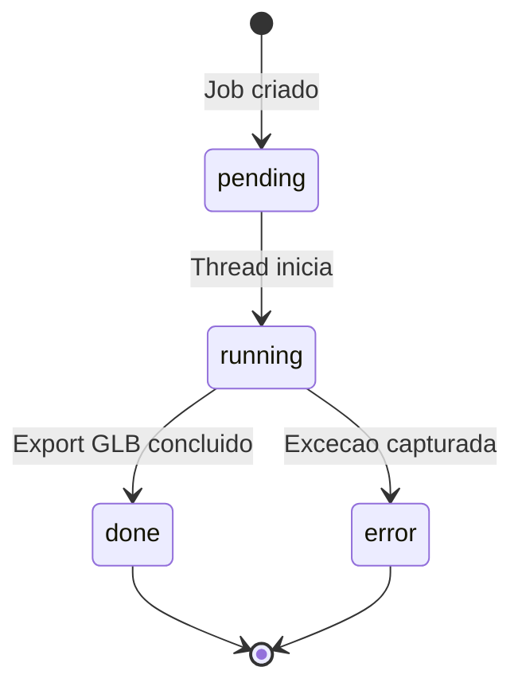

# System Feature Flows

> Registro historico e incremental dos fluxos internos de cada funcionalidade.
> Este documento cresce a cada nova feature implementada e nunca tem secoes removidas.

---

## Indice

- [Visao Geral da Arquitetura](#visao-geral-da-arquitetura)
- [Convencoes deste Documento](#convencoes-deste-documento)
- [Feature: Inferencia 3D com TripoSR](#feature-inferencia-3d-com-tiposr)
- [Feature: Patch do Isosurface (scikit-image)](#feature-patch-do-isosurface-scikit-image)
- [Feature: Deteccao de Dispositivo (ROCm/CUDA/CPU)](#feature-deteccao-de-dispositivo-rocmcudacpu)
- [Feature: Fila Assincrona de Jobs](#feature-fila-assincrona-de-jobs)
- [Feature: Port Linux ROCm](#feature-port-linux-rocm)

---

## Visao Geral da Arquitetura

**Padrao arquitetural:** Aplicacao monolitica com API REST + fila de jobs assincrona

**Stack:** Python 3.12 + FastAPI + PyTorch 2.12.1+rocm7.1 + TripoSR

**Porta:** 8080

**Fluxo completo da aplicacao:**



**Fluxo simplificado em pipeline:**



**Camadas e responsabilidades:**

| Camada | Responsabilidade |
|--------|-----------------|
| `api/main.py` | FastAPI app, lifespan, frontend mount, health check |
| `api/routers/generate.py` | Endpoints REST: generate, status, download, device |
| `api/services/model_service.py` | Modelo TripoSR, device detection, fila de jobs, isosurface patch |
| `frontend/index.html` | Interface web estatica |

---

## Convencoes deste Documento

- **Erros de dominio** sao retornados como HTTPException com codigo adequado
- **Erros de infra** sao capturados no job e expostos no campo `error`
- **Jobs** sao executados em `threading.Thread` daemon
- **Modelo** e carregado sob lock e uma unica vez (lazy loading)
- **Caminhos de arquivo** seguem XDG: `~/.local/share/image3d/`

---

# Feature: Inferencia 3D com TripoSR

> **Versao:** 1.0.0
> **Implementada em:** 2026-06-26
> **Status:** Concluido

---

## Resumo

O servico carrega o modelo TripoSR (VAST-AI-Research) em uma GPU ROCm ou CUDA, recebe uma imagem, remove o fundo, gera codigos de cena 3D e extrai uma malha via marching cubes.

**Motivacao:** Converter fotos em modelos 3D editaveis (GLB) para uso em jogos, visualizacao ou impressao 3d.

**Resultado:** Arquivo GLB baixavel com malha texturizada.

---

## Fluxo Principal

### 1. Ponto de Entrada

- **Tipo:** HTTP REST
- **Arquivo:** `api/routers/generate.py`
- **Rota:** `POST /api/generate`
- **Autenticacao:** Nenhuma (acesso local)

### 2. Validacao de Entrada

- **Arquivo:** `api/routers/generate.py:17-18`

| Campo | Tipo | Obrigatorio | Regra de validacao |
|-------|------|-------------|---------------------|
| image | UploadFile | Sim | `content_type` deve comecar com `image/` |
| resolution | int (Form) | Nao | Default 256 |
| mc_threshold | float (Form) | Nao | Default 25.0 |

### 3. Orquestracao da Aplicacao

- **Arquivo:** `api/services/model_service.py:268-303`

1. Cliente faz upload da imagem (`POST /api/generate`)
2. Servico cria job com UUID e retorna `job_id`
3. Thread separada executa o pipeline:
   1. `_load()` — carrega TripoSR no dispositivo detectado (uma vez)
   2. `_preprocess()` — remove fundo com rembg
   3. `model(image)` — gera scene codes no dispositivo
   4. `extract_mesh()` — marching cubes com resolucao/configuraveis
   5. `mesh.export()` — salva GLB em `OUTPUTS_DIR`
4. Cliente polla `GET /api/status/{job_id}` ate `status=done`
5. Cliente baixa `GET /api/download/{filename}`

### 4. Regras de Negocio

| Regra | Descricao | Localizacao no Codigo |
|-------|-----------|----------------------|
| Lazy loading | Modelo carregado sob lock na primeira requisicao | `model_service.py:209-253` |
| Device fallback | ROCm > CUDA > CPU com fallback em erro `.to()` | `model_service.py:243-249` |
| Background removal | rembg sempre aplicado antes da geracao | `model_service.py:312-318` |
| Isosurface patch | scikit-image usado se torchmcubes ausente | `model_service.py:115-120` |
| Mesh export | Formato GLB (model/gltf-binary) | `model_service.py:296-298` |

### 5. Resposta Final

**Sucesso — `200`:**

```json
{
  "job_id": "uuid-string",
  "status": "done",
  "progress": 100,
  "step": "Done",
  "output": "1712345678_abcd1234.glb",
  "error": null
}
```

**Erro — `400`:**

```json
{
  "detail": "File must be an image"
}
```

**Erro — `404`:**
```json
{
  "detail": "Job {job_id} not found"
}
```

---

## Fluxos Alternativos e Erros

| Cenário | HTTP Status | Mensagem |
|---------|-------------|----------|
| Arquivo nao e imagem | 400 | File must be an image |
| Job inexistente | 404 | Job {job_id} not found |
| Arquivo nao encontrado no download | 404 | File not found |
| Path traversal no download | 400 | Invalid filename |
| Erro durante geracao | 200 (status=error) | Campo `error` com traceback |

---

## Diagrama de Sequencia



---

## Decisoes Tecnicas

### ADR-001 — TripoSR como modelo de geracao 3D

| Campo | Detalhe |
|-------|---------|
| **Status** | Aceita |
| **Data** | 2026-06-26 |
| **Contexto** | Necessario modelo de image-to-3D com boa qualidade e licenca permisiva |
| **Decisao** | Usar TripoSR (stabilityai/TripoSR), modelo estado-da-arte para geracao unica de imagem para 3D |
| **Consequencias** | Dependencia de ~1.5 GB de weights, GPU com >= 6 GB VRAM recomendada |

### ADR-002 — scikit-image marching cubes como fallback

| Campo | Detalhe |
|-------|---------|
| **Status** | Aceita |
| **Data** | 2026-06-26 |
| **Contexto** | TripoSR depende de torchmcubes, que nao tem binarios para ROCm |
| **Decisao** | Substituir isosurface.py com implementacao propria baseada em scikit-image `measure.marching_cubes` |
| **Consequencias** | Implementacao completa de MarchingCubeHelper com interface compativel. Performance aceitavel em CPU/GPU. |

---

# Feature: Patch do Isosurface (scikit-image)

> **Versao:** 1.0.0
> **Implementada em:** 2026-06-26
> **Status:** Concluido

---

## Resumo

O modulo `isosurface.py` do TripoSR e substituido por uma implementacao que usa `skimage.measure.marching_cubes` em vez de `torchmcubes`, que nao possui suporte a ROCm.

**Motivacao:** torchmcubes nao distribui binarios para ROCm Linux. O patch permite execucao em AMD GPUs.

**Resultado:** MarchingCubeHelper funcional com interface identica a original.

---

## Fluxo Principal

### 1. Ponto de Entrada

- **Arquivo:** `api/services/model_service.py:115-120`
- **Funcao:** `_patch_isosurface(src_dir)`

### 2. Implementacao

- **Arquivo:** `api/services/model_service.py:74-112`
- **Classe:** `MarchingCubeHelper`

| Metodo | Descricao |
|--------|-----------|
| `__init__(resolution)` | Cria grid de vertices [-1, 1] com resolucao N |
| `grid_vertices` | Property retorna tensor [N^3, 3] |
| `points_range` | Property retorna (-1, 1) |
| `__call__(level)` | Executa marching cubes, retorna (vertices, faces) |

### 3. Comportamento

1. Na inicializacao do servico, `_patch_isosurface` verifica se `isosurface.py` existe
2. Se existe mas nao contem `skimage`, sobrescreve com o patch
3. Durante `_load()`, patch e reaplicado mesmo em cache existente
4. Modulos `tsr.*` sao removidos de `sys.modules` para forçar reload

---

# Feature: Deteccao de Dispositivo (ROCm/CUDA/CPU)

> **Versao:** 1.0.0
> **Implementada em:** 2026-06-26
> **Status:** Concluido

---

## Resumo

O servico detecta automaticamente o melhor dispositivo disponivel para inferencia: ROCm (AMD GPU), CUDA (NVIDIA GPU) ou CPU.

**Motivacao:** Suportar multiplas configuracoes de hardware sem configuracao manual.

**Resultado:** Device selection transparente com fallback.

---

## Fluxo Principal

### 1. Logica de Deteccao

- **Arquivo:** `api/services/model_service.py:40-51`
- **Funcao:** `_get_device()`

1. `torch.cuda.is_available()` retorna True
2. Verifica `torch.version.hip`:
   - Se presente: retorna `device=cuda`, `name=ROCm (HIP {version})`
   - Se ausente: retorna `device=cuda`, `name=CUDA ({GPU name})`
3. Se nenhum GPU: retorna `device=cpu`, `name=CPU`

### 2. Fallback em Runtime

- **Arquivo:** `api/services/model_service.py:243-249`

Se `model.to(device)` falha (e.g., VRAM insuficiente), o servico tenta CPU como fallback.

---

# Feature: Fila Assincrona de Jobs

> **Versao:** 1.0.0
> **Implementada em:** 2026-06-26
> **Status:** Concluido

---

## Resumo

Jobs de geracao sao executados em threads separadas com progresso reportado via polling.

**Motivacao:** Geracao 3D leva dezenas de segundos — nao pode bloquear a API.

**Resultado:** Cliente recebe `job_id` imediatamente e polla o progresso.

---

## Fluxo Principal

### 1. Submissao

- **Arquivo:** `api/services/model_service.py:261-266`

```python
def submit(self, image_bytes: bytes, params: dict) -> str:
    job_id = str(uuid.uuid4())
    job = Job(job_id)
    self._jobs[job_id] = job
    threading.Thread(target=self._run, args=(job, image_bytes, params), daemon=True).start()
    return job_id
```

### 2. Acompanhamento

| Campo | Descricao |
|-------|-----------|
| `status` | pending -> running -> done / error |
| `progress` | 0-100 (estimado) |
| `step` | Descricao textual da etapa atual |
| `output` | Nome do arquivo GLB gerado |
| `error` | Traceback em caso de erro |

### 3. Estados



---

# Feature: Port Linux ROCm

> **Versao:** 0.2.0
> **Implementada em:** 2026-06-26
> **Status:** Concluido

---

## Resumo

Projeto adaptado do ecossistema Windows (DirectML) para Linux com ROCm. Inclui launcher shell, suporte a uv, deteccao de dispositivo ROCm, e compatibilidade com AMD Radeon RX 7600 (gfx1102).

**Motivacao:** Democratizar acesso a geracao 3D em hardware AMD Linux.

**Resultado:** `launch.sh` funcional com ROCm, fallback CUDA/CPU.

---

## Novos Arquivos

| Arquivo | Responsabilidade |
|---------|-----------------|
| `launch.sh` | Launcher Linux com uv, instalacao PyTorch ROCm, inicializacao servidor |
| `pyproject.toml` | Metadados do projeto, script `serve` |

## Arquivos Modificados

| Arquivo | Mudanca |
|---------|---------|
| `requirements.txt` | Ajustado para Python 3.12, removidas dependencias Windows-especificas |
| `api/services/model_service.py` | Adicionado runtime lib setup (`LD_LIBRARY_PATH`), deteccao HIP, isosurface patch |

## Componentes Preservados

| Componente | Motivo |
|------------|--------|
| `launch.bat` | Usuarios Windows existentes |
| `frontend/` | Nao requer alteracao |

## Dependencias

### Linux (novo)

| Dependencia | Versao | Origem |
|-------------|--------|--------|
| torch | 2.12.1+rocm7.1 | pytorch.org/whl/rocm7.1 |
| torchvision | 0.27.1+rocm7.1 | pytorch.org/whl/rocm7.1 |
| scikit-image | >=0.24.0 | PyPI (marching cubes) |

### Windows (preservado)

| Dependencia | Nota |
|-------------|------|
| torch | DirectML (instalacao manual) |
| torchmcubes | Necessario para isosurface original |

## Armazenamento

Path unificado para Linux: `~/.local/share/image3d/{models,outputs}`

```bash
~/.local/share/image3d/
├── models/
│   ├── _triposr_src/   # Source code do TripoSR (git archive)
│   └── triposr/        # Weights (model.ckpt + config.yaml)
└── outputs/            # GLB gerados
```
